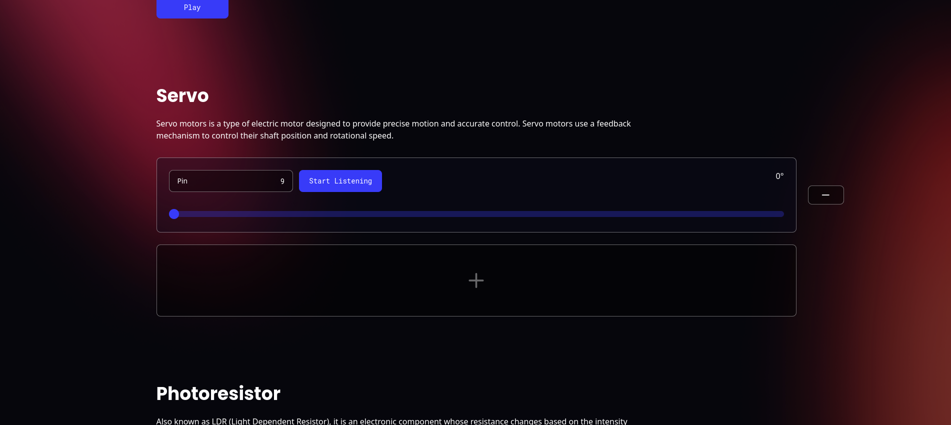

# Lunar Vein: Arduino

A **SIMPLE** REST API based serial communication. Assisted Firmata protocol and johnny-five API, enabling software communication with the Arduino board using the Server API. that's it. Idk about electronics and networking actually. But that piece of knowledge motivated me to make some IoT stuff. Enjoy (⁠づ⁠￣⁠ ⁠³⁠￣⁠)⁠づ


<small>*the animation is from ENA BBQ series by JoelG</small>

## Setup
Tools that are required
- Arduino Board
- [Arduino IDE](https://www.arduino.cc/en/software)
- [Node.js](https://nodejs.org/en) v16.0.0^ or other javascript runtime

### Board
Arduino assembly guide also available in [johnny-five](https://github.com/rwaldron/johnny-five?tab=readme-ov-file#setup-and-assemble-arduino) documentation
1. Plug in your Board via USB
2. Open Arduino IDE then select your Board
3. Go to `File > Examples > Firmata` Select `StandarFirmataPlus`
4. Upload the sketch

### Server
1. Clone project and Install

    ```bash
    git clone https://github.com/norman-andrians/lunar-vein-arduino.git && cd lunar-vein-arduino
    npm i
    ```

2. Add `.env` file in the project root directory with the `SERIAL_PORT` variable

    ```dotenv
    SERIAL_PORT=/dev/ttyUSB0
    ```

3. Run the project

    ```bash
    npm start
    ```

4. If the board is connected try to open the client page in [https://localhost:3000/](https://localhost:3000/)

    

#### Other scripts
- You can see what ports are connected to the device by running `npm run ports` script.

    ```bash
    npm run ports
    ```
    ```
    > lunar-vein-arduino@1.0.0 ports
    > ts-node src/ports/print.ts

    3 Ports available
    1. /dev/ttyUSB0
    2. /dev/ttyUSB1
    3. /dev/ttyACM0
    ```

# REST API Documentation

## Table of contents
- [Common HTTP Responses](#common-http-responses)
- [JSON Response](#json-response)
- [Example Request](#example-request)
- [Digital](#digital)
    - [Digital Read](#digital-read)
    - [Digital Write](#digital-write)
- [Analog](#analog)
    - [Analog Read](#analog-read)
    - [Analog Write](#analog-write)
- [PIN](#pin)
    - [Read PIN Mode](#read-pin-mode)
    - [Set PIN Mode](#set-pin-mode)
- [LED](#led)
    - [Read LED state](#read-led-state)
    - [Set LED state](#set-led-state)
- [RGB LED](#rgb-led)
    - [Read RGB state](#read-rgb-state)
    - [Set RGB state](#set-rgb-state)
- [Piezo](#piezo)
    - [Piezo Tone](#piezo-tone)
    - [Piezo Note](#piezo-note)
    - [Piezo Play Music](#piezo-play-music)

## Common HTTP Responses
Some HTTP responses are sent with JSON, otherwise an HTML body will be sent which is the default express.js response 

| HTTP Status | Marks |
|-------------|-------|
| 200 | The request `act` was successful |
| 400 | You may be making an invalid request, try to check the payload or recheck the documentation. |
| 404 | The resource wass not found |
| 405 | Method not allowed, servers usually only accept `GET` and `PATCH` methods |
| 500 | An error in the app server, if it continues please raise an issue or ask to contribute. |

## JSON Response
```json
{
    "status": 200,
    "pin_state": {
        "13": "HIGH"
    },
    "message": "Changed pin state 13 to HIGH"
}
```
| Property | Description |
|----------|-------------|
| status | HTTP Status code |
| pin_state | The state value of the pin that has been changed |
| message | Descriptive message of the changed state |

## Example Request
This is an example of sending a request to turn on the LED light, [See LED API](#set-led-state)

**Using curl**

```bash
curl -X PATCH http://localhost:3000/api-arduino/led/13/on
```

**Using fetch async/await javascript**

```javascript
async function turnOnLed() {
    const res = await fetch("http://localhost:3000/api-arduino/led/13/on", { method: 'PATCH' }); // Set LED to HIGH
    const data = await res.json();
    console.log(data); // { status: 200, pin_state: { 13: high }, message: "Pin 13 Set to HIGH" }
}
```

## Digital

### Digital Read
- **URL Endpoint**

    `/api-arduino/digital/:pin`
    
- **URL Params**
    
    | Params | Mark | Type | Required | Description |
    |--------|------|------|----------|-------------|
    | pin | pin | `string` | true | Seleced pin |

- **Method**

    `GET`

- **Example Request**
    ```javascript
    fetch("http://localhost:3000/api-arduino/digital/13")
        .then(res => res.json())
        .then(res => console.log(res))
        .catch(err => console.error('error', err));
    ```

- **Example Response**

    ```json
    {
        "status": 200,
        "pin_state": {
            "13": "HIGH"
        }
    }
    ```

### Digital Write
- **URL Endpoint**

    `/api-arduino/digital`
    
- **Body**
    
    ```typescript
    {
        pin: number,
        state: 'HIGH' | 'LOW' | 1 | 0 | string
    }
    ```

- **Method**

    `PATCH`

- **Example Request**

    ```javascript
    var data = {
        pin: 13,
        state: 'LOW'
    }

    var options = {
        method: 'PATCH',
        body: JSON.stringify(data),
        headers: {
            'Content-Type': 'application/json'
        },
        redirect: 'follow'
    }

    fetch("http://localhost:3000/api-arduino/digital", options)
        .then(res => res.json())
        .then(res => console.log(res))
        .catch(err => console.error('error', err));
    ```

- **Example Response**

    ```json
    {
        "status": 200,
        "pin_state": {
            "13": "HIGH"
        }
    }
    ```

## Analog

### Analog Read
- **URL Endpoint**

    `/api-arduino/analog/:p`
    
- **URL Params**
    
    | Params | Mark | Type | Required | Description |
    |--------|------|------|----------|-------------|
    | pin | pin | `string` | true | Seleced pin |

- **Method**

    `GET`

- **Example Request**
    ```javascript
    fetch("http://localhost:3000/api-arduino/analog/A0")
        .then(res => res.json())
        .then(res => console.log(res))
        .catch(err => console.error('error', err));
    ```

- **Example Response**

    ```json
    {
        "status": 200,
        "analog_state": {
            "A0": 1023
        }
    }
    ```

### Analog Write
- **URL Endpoint**

    `/api-arduino/analog`
    
- **Body**
    
    ```typescript
    {
        pin: string | number,
        value: number
    }
    ```

- **Method**

    `PATCH`

- **Example Request**

    ```javascript
    var data = {
        pin: 'A0',
        value: 1023
    }

    var options = {
        method: 'PATCH',
        body: JSON.stringify(data),
        headers: {
            'Content-Type': 'application/json'
        },
        redirect: 'follow'
    }

    fetch("http://localhost:3000/api-arduino/analog", options)
        .then(res => res.json())
        .then(res => console.log(res))
        .catch(err => console.error('error', err));
    ```

- **Example Response**

    ```json
    {
        "status": 200,
        "pin_state": {
            "13": 1023
        }
    }
    ```


## PIN

### Read PIN Mode
- **URL Endpoint**

    `/api-arduino/pin/:p/`
    
- **URL Params**
    
    | Params | Mark | Type | Required | Description |
    |--------|------|------|----------|-------------|
    | p | pin | `string` | true | Seleced pin |

- **Method**

    `GET`

- **Example Request**

    ```javascript
    fetch("http://localhost:3000/api-arduino/pin/13")
        .then(res => res.json())
        .then(res => console.log(res))
        .catch(err => console.error('error', err));
    ```

- **Example Response**

    ```json
    {
        "status": 200,
        "pins": [
            {
                "pin": 13,
                "mode": "OUTPUT"
            }
        ],
        "message": "Pin 13 is OUTPUT"
    }
    ```

### Set PIN Mode
- **URL Endpoint**

    `/api-arduino/pin/:p/:m`
    
- **URL Params**
    
    | Params | Mark | Type | Required | Description |
    |--------|------|------|----------|-------------|
    | p | pin | `string` | true | Seleced pin |
    | m | mode | `'input'`, `'output'`, `'servo'` | true | Pin Mode |

- **Method**

    `PATCH`

- **Example Request**

    ```javascript
    fetch("http://localhost:3000/api-arduino/pin/13/output", { method: 'PATCH' })
        .then(res => res.json())
        .then(res => console.log(res))
        .catch(err => console.error('error', err));
    ```

- **Example Response**

    ```json
    {
        "status": 200,
        "pins": [
            {
                "pin": 13,
                "mode": "OUTPUT"
            }
        ],
        "message": "Pin 13 setted as OUTPUT"
    }
    ```


## LED

### Read LED state
- **URL Endpoint**

    `/api-arduino/led/:p/`
    
- **URL Params**
    
    | Params | Mark | Type | Required | Description |
    |--------|------|------|----------|-------------|
    | p | pin | `string` | true | Seleced pin |

- **Method**

    `GET`

- **Example Request**

    ```javascript
    fetch("http://localhost:3000/api-arduino/led/13")
        .then(res => res.json())
        .then(res => console.log(res))
        .catch(err => console.error('error', err));
    ```

- **Example Response**

    ```json
    {
        "status": 200,
        "pin_state": {
            "13": "HIGH"
        },
        "message": "Led pin 13 is HIGH"
    }
    ```

### Set LED state
- **URL Endpoint**

    `/api-arduino/led/:p/:a`
    
- **URL Params**
    
    | Params | Mark | Type | Required | Description |
    |--------|------|------|----------|-------------|
    | p | pin | `string` | true | Seleced pin |
    | a | act | `'on'`, `'off'`, `'high'`, `'low'` | true | Action |

- **Method**

    `PATCH`

- **Example Request**

    ```javascript
    fetch("http://localhost:3000/api-arduino/led/13/output", { method: 'PATCH' })
        .then(res => res.json())
        .then(res => console.log(res))
        .catch(err => console.error('error', err));
    ```

- **Example Response**

    ```json
    {
        "status": 200,
        "pin_state": {
            "13": "HIGH"
        },
        "message": "Changed pin state 13 to HIGH"
    }
    ```


## RGB LED

### Read RGB state
- **URL Endpoint**

    `/api-arduino/rgb-led`
    
- **Body**

    ```typescript
    {
        r: number,
        g: number,
        b: number
    }
    ```

- **Method**

    `POST`

- **Example Request**

    ```javascript
    var data = {
        r: 7,
        g: 6,
        b: 5
    }

    var options = {
        method: 'POST',
        body: JSON.stringify(data),
        headers: {
            'Content-Type': 'application/json'
        },
        redirect: 'follow'
    }

    fetch("http://localhost:3000/api-arduino/rgb-led", options)
        .then(res => res.json())
        .then(res => console.log(res))
        .catch(err => console.error('error', err));
    ```

- **Example Response**

    ```json
    {
        "status": 200,
        "pin_state": {
            "7": true,
            "6": true,
            "5": false
        }
    }
    ```

### Set RGB state
- **URL Endpoint**

    `/api-arduino/rgb-led`
    
- **Body**
    
    ```typescript
    {
        r: {
            pin: number,
            value: boolean
        },
        g: {
            pin: number,
            value: boolean
        },
        b: {
            pin: number,
            value: boolean
        }
    }
    ```

- **Method**

    `PATCH`

- **Example Request**

    ```javascript
    var data = {
        r: {
            pin: 7,
            value: true
        },
        g: {
            pin: 6,
            value: true
        },
        b: {
            pin: 5,
            value: false
        }
    }

    var options = {
        method: 'PATCH',
        body: JSON.stringify(data),
        headers: {
            'Content-Type': 'application/json'
        },
        redirect: 'follow'
    }

    fetch("http://localhost:3000/api-arduino/rgb-led", options)
        .then(res => res.json())
        .then(res => console.log(res))
        .catch(err => console.error('error', err));
    ```

- **Example Response**

    ```json
    {
        "status": 200,
        "pin_state": {
            "7": true,
            "6": true,
            "5": false
        },
        "message": "Success changed pins 7, 6, 5 to state HIGH, HIGH, LOW"
    }
    ```


## Piezo

### Piezo Tone
- **URL Endpoint**

    `/api-arduino/piezo/:p/:f`
    
- **URL Params**
    
    | Params | Mark | Type | Required | Description |
    |--------|------|------|----------|-------------|
    | p | pin | `string` | true | Seleced pin |
    | f | frequency | `number` | true | Frequency |

- **Method**

    `PATCH`

- **Example Request**

    ```javascript
    fetch("http://localhost:3000/api-arduino/piezo/6/300", { method: 'PATCH' })
        .then(res => res.json())
        .then(res => console.log(res))
        .catch(err => console.error('error', err));
    ```

- **Example Response**

    ```json
    {
        "status": 200,
        "pin_tone": {
            "6": 300
        },
        "message": "Piezo 6 tone 300"
    }
    ```

### Piezo Note
- **URL Endpoint**

    `/api-arduino/piezo/note`
    
- **Body**
    
    ```typescript
    {
        pin: number,
        note: string
    }
    ```

- **Method**

    `PATCH`

- **Example Request**

    ```javascript
    var data = {
        pin: 6,
        note: "B3"
    }

    var options = {
        method: 'PATCH',
        body: JSON.stringify(data),
        headers: {
            'Content-Type': 'application/json'
        },
        redirect: 'follow'
    }

    fetch("http://localhost:3000/api-arduino/piezo/note", options)
        .then(res => res.json())
        .then(res => console.log(res))
        .catch(err => console.error('error', err));
    ```

- **Example Response**

    ```json
    {
        "status": 200,
        "pin_tone": {
            "6": 247
        },
        "pin_note": {
            "6": "B3"
        },
        "message": "Piezo 6 tone note B3"
    }
    ```


### Piezo Play Music
- **URL Endpoint**

    `/api-arduino/piezo/music`
    
- **Body**
    
    ```typescript
    {
        pin: number,
        notes: string[],
        beats: number,
        tempo: number
    }
    ```

    Example

    ```javascript
    {
        pin: 6,
        notes: ["F4", "G4", "F4", "G4"],
        beats: 1/4,
        tempo: 100
    }
    ```

- **Method**

    `PATCH`

- **Example Request**

    ```javascript
    var data = {
        pin: 6,
        notes: ["E4", "E4", "F4", "G4", "G4", "F4", "E4", "D4", "C4", "C4", "D4", "E4", "D4", "-", "C4", "C4"], // ode to joy notes
        beats: 1/2,
        tempo: 100
    }

    var options = {
        method: 'PATCH',
        body: JSON.stringify(data),
        headers: {
            'Content-Type': 'application/json'
        },
        redirect: 'follow'
    }

    fetch("http://localhost:3000/api-arduino/piezo/music", options)
        .then(res => res.json())
        .then(res => console.log(res))
        .catch(err => console.error('error', err));
    ```

- **Example Response**

    ```json
    {
        "status": 200,
        "pin_notes": {
            "6": [ "E4", "E4", "F4", "G4", "G4", "F4", "E4", "D4", "C4", "C4", "D4", "E4", "D4", "-", "C4", "C4" ]
        },
        "message": "Piezo 6 play notes E4, E4, F4, G4..."
    }
    ```